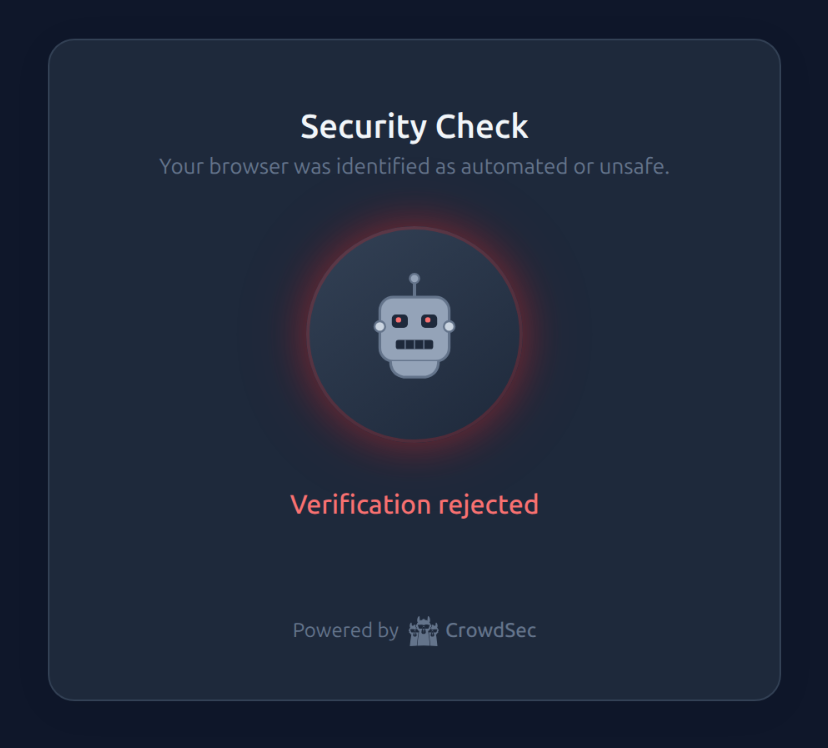
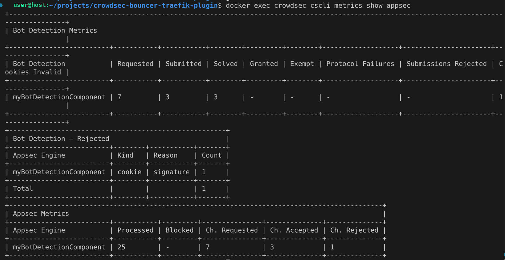

# Example
## Bot detection with the AppSec challenge

AppSec bot detection, added in CrowdSec 1.8.0, answers a request with a challenge page
instead of a plain block. The browser solves a proof of work and gets a cookie that lets the
following requests through.

That needs the bouncer to relay what AppSec sends back: a ban is a status code, a challenge
is a status code plus a body, cookies and headers.

Docs: [intro](https://docs.crowdsec.net/docs/appsec/bot_detection/intro),
[enable](https://docs.crowdsec.net/docs/appsec/bot_detection/enable),
[challenge protocol](https://docs.crowdsec.net/docs/appsec/bot_detection/challenge_protocol).

### Two things that fail silently

**The router must also match `/crowdsec-internal`.** The challenge page loads its fingerprint
script and proof-of-work worker from there by absolute path. Scope the router to your
application prefix alone and they 404, so the challenge can never be solved and nothing is
logged:

```yaml
  - "traefik.http.routers.router-foo.rule=PathPrefix(`/foo`) || PathPrefix(`/crowdsec-internal`)"
```

**The acquisition must load the config that calls `SendChallenge()`**, which is
`appsec-bot-challenge-scoring`; the `-balanced` variant only carries the rejection threshold.
The wildcard below is the form from the enable guide, and it also picks up the exclusion
configs the collection ships:

```yaml
appsec_configs:
  - crowdsecurity/appsec-default
  - crowdsecurity/appsec-bot-*
```

> **Warning:** leave `crowdsecAppsecBodyLimit` above 0. At 0 the browser's solved challenge is
> never forwarded to AppSec, so it can never be validated and the client loops on the page.

`WAF challenge runtime initialized` in the CrowdSec logs means the configuration is right.

### Running it

```bash
make run_bot_detection
```

Open http://localhost:8000/foo in a browser: challenge page, then whoami. curl gets the same
page but cannot solve it, which is the point.

A client that fails the fingerprint scoring is told so rather than silently blocked:



Relaying the AppSec remediation landed in plugin 1.8.0, so that is the version the compose
file pins. To run it against the working tree instead, swap in the `localplugins` lines that
are there commented out.

### Troubleshooting

```bash
docker exec crowdsec cscli metrics show appsec
```

`Ch. Requested` at 0 while `Processed` climbs means requests reach AppSec but nothing
challenges them, so the acquisition config is wrong rather than the bouncer.



[Output of cscli metrics appsec](../../../../../..)

[Failed challenge Crowdsec bot detected](../../../../../..)
> Bot detection is flagged **Alpha** by CrowdSec. The challenge needs SSE4.1 and
> writable-executable memory, so hardened or older clients cannot solve it.
