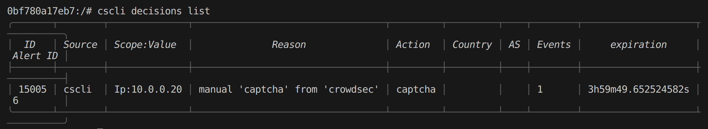
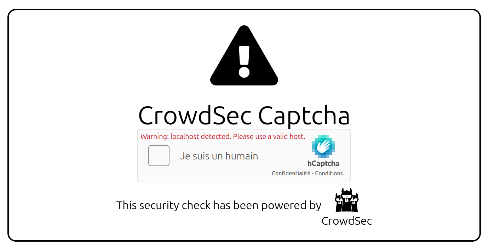
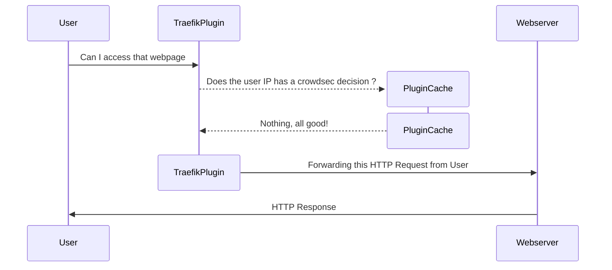
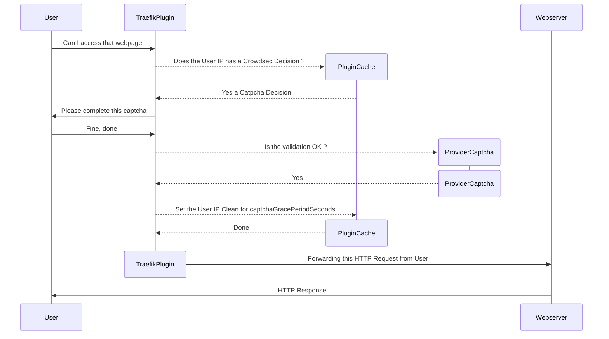
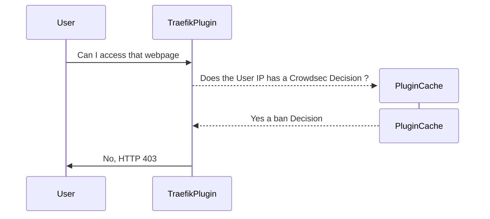
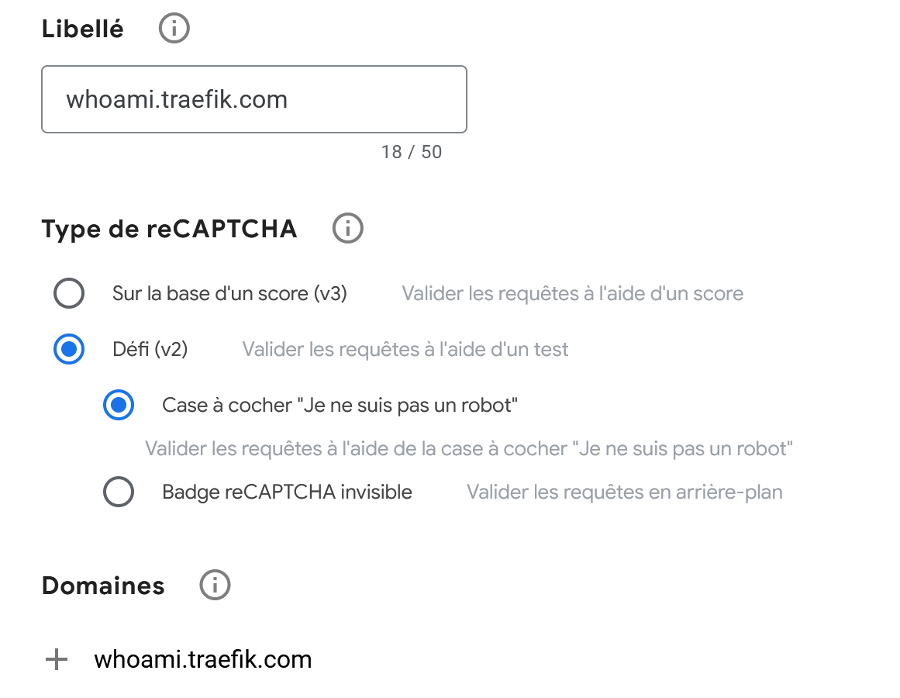

# Example
## Enabling catpcha response from crowdsec

Crowdsec support 3 remediations solutions `ban`, `captcha`, and `throttle`.  
This plugins support the `ban` and `captcha` remediation.  

### Traefik configuration

The minimal configuration is defined below.  
For now 4 captcha providers are supported:
 - [hcaptcha](https://www.hcaptcha.com/)
 - [recaptcha](https://www.google.com/recaptcha/about/)
 - [turnstile](https://www.cloudflare.com/fr-fr/products/turnstile/)
 - [eucaptcha](https://eu-captcha.eu/) — GDPR-compliant, EU-hosted

```yaml
  labels:
      # Choose captcha provider
      - "traefik.http.middlewares.crowdsec.plugin.bouncer.captchaProvider=hcaptcha"
      # Define captcha site key
      - "traefik.http.middlewares.crowdsec.plugin.bouncer.captchaSiteKey=FIXME"
      # Define captcha secret key
      - "traefik.http.middlewares.crowdsec.plugin.bouncer.captchaSecretKey=FIXME"
      # Define captcha grace period seconds
      - "traefik.http.middlewares.crowdsec.plugin.bouncer.captchaGracePeriodSeconds=1800"
      # Define captcha HTML file path
      - "traefik.http.middlewares.crowdsec.plugin.bouncer.captchaHTMLFilePath=/captcha.html"
```

The captcha HTML file must be present in the Traefik container (bind mounted or added during a custom build).  
It is not directly accessible from Traefik even when importing the plugin, so [download](https://raw.githubusercontent.com/maxlerebourg/crowdsec-bouncer-traefik-plugin/master/captcha.html) it locally to expose it to Traefik.

```yaml 
  ...
  traefik:
    image: "traefik:v3.0.0"
    volumes:
      - './captcha.html:/captcha.html'
  ...
```
### Crowdsec configuration

Crowdsec by default will take the ban action on suspicious activity detected in logs.  
To instruct Crowdsec to use captcha remediation, change the `/etc/crowdsec/profiles.yaml`.   

2 modes are supported:
- Always return a captcha decision
- Return a captcha decision the first X times and then a ban decision.

The second mode could be used to prevent repeated malicious activity.
More information is available on configuring Crowdsec in the [official documentation](https://docs.crowdsec.net/docs/next/local_api/profiles/captcha_profile/).

```yaml
  ...
  crowdsec:
    image: crowdsecurity/crowdsec:v1.6.1-2
    volumes:
      # For captcha and ban mixed decision
      - './profiles.yaml:/etc/crowdsec/profiles.yaml:ro' 
      # For captcha only remediation
      # - './profiles_captcha_only.yaml:/etc/crowdsec/profiles.yaml:ro'
  ...
```
## Exemple navigation
We can try to query normally the whoami server:
```bash
curl http://localhost:8000/foo
```

We can try to ban ourself

```bash
docker exec crowdsec cscli decisions add --ip 10.0.0.20 -d 4h --type captcha
```



We will see in the browser the captcha validation page:



To play the demo environment run:
```bash
make run_captcha
```

> Note, if we are banned with a "ban" decision from crowdsec a captcha will not be asked and you will have to wait for the decision to expire or remove it manually.  

```bash
docker exec crowdsec cscli decisions add --ip 10.0.0.10 -d 10m --type ban
```

## Captcha Workflow

> Context: The user has no decision attached to his IP



> Context: The user has a captcha decision attached to his IP



> Context: The user has a ban decision attached to his IP



## Captcha Configuration:

- Recaptcha

Choose v2 (challenge) and configure the domain to protect:  


- Turnstile

TODO

- Hcaptcha

TODO

- EU CAPTCHA

Sign up at [app.eu-captcha.eu](https://app.eu-captcha.eu), create a sitekey for your domain, and use `eucaptcha` as the provider:

```yaml
captchaProvider: eucaptcha
captchaSiteKey: <your-sitekey>      # public key shown in the widget
captchaSecretKey: <your-secret>     # private key used for server-side verification
captchaGracePeriodSeconds: 1800
captchaHTMLFilePath: /captcha.html
```

EU CAPTCHA is a GDPR-compliant, privacy-first anti-bot service hosted entirely within the EU.
Unlike other providers it sends additional context (client IP and user agent) to the verification endpoint,
and returns a `train` flag alongside `success`; a `train: true` response is treated as a failure and
the challenge is shown again.
