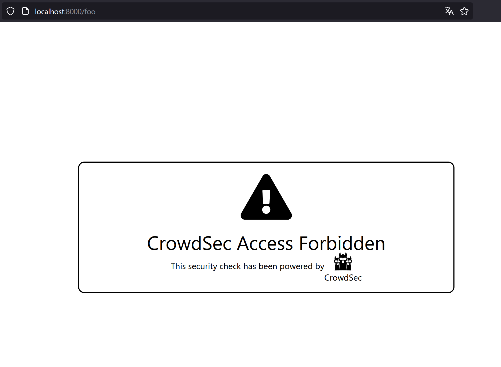

# Example
## Adding a custom ban page

Traefik can return a custom HTML ban page along with the 403 HTTP response code.  
This can be usefull as some browser (Firefox for instance) return a 403 blank webpage and we can mistake a server/reverse-proxy error with a ban from Crowdsec.  

### Traefik configuration


```yaml
  labels:
      # Define ban HTML file path
      - "traefik.http.middlewares.crowdsec.plugin.bouncer.banHtmlFilePath=/ban.html"
```

The ban HTML file must be present in the Traefik container (bind mounted or added during a custom build).  
It is not directly accessible from Traefik even when importing the plugin, so [download](https://raw.githubusercontent.com/maxlerebourg/crowdsec-bouncer-traefik-plugin/master/ban.html) it locally to expose it to Traefik.

```yaml 
  ...
  traefik:
    image: "traefik:v2.11.0"
    volumes:
      - './ban.html:/ban.html'
  ...
```

## Exemple navigation

We can try to query normally the whoami server:
```bash
curl http://localhost:8000/foo
```

We can try to ban ourself

```bash
docker exec crowdsec cscli decisions add --ip 10.0.0.20 -d 4h --type ban
```


We will see in the browser the ban custom page:

To play the demo environment run:
```bash
make run_custom_ban_page
```

## Another thing to note
In the html of the ban page, you can use {{ .RemediationReason }} that convert on runtime into why the ban page is served.
It's an enum with "APPSEC", "LAPI", "TECHNICAL_ISSUE".
It is useful to help user understand why the request is blocked.
```
<script>var remediation = "{{ .RemediationReason }}"</script>
```
With the above tweak and some other js, you can customize your ban page on runtime.
